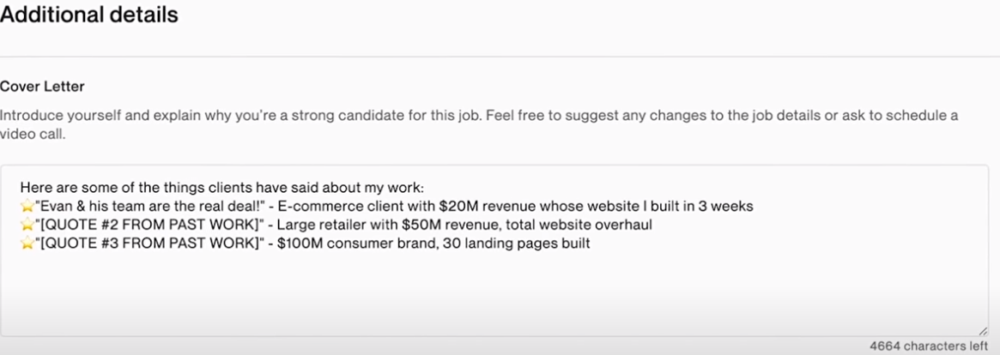

# From Youtube Example

[https://www.youtube.com/watch?v=f4INGRluDAU](https://www.youtube.com/watch?v=f4INGRluDAU)

## Cover letter NO's!

- Dear Sir / Madan (No!)
- I am certain that I fully understand your job requirements (No!)
- I promise I will (No!)
- Please consider my proposal (No!)
- You asked for two relevant work examples I gave 4 (No!)
- I already did a draft of your job (No!)
- Here are some quotestions on your job (No! / Sometimes)

## Cover Letter YES's

- Use the client's name (Dear John)
- Also use names when talking about other jobs like: `I worked with Hannah on a project simular...` but if it is very simular then rather write the following: `I've worked with another client in this space, and I think you might find it interesting to have a chat`
- Keep proposal short
- Hit them with authority and social proof
- Show them your value
- Use quote form past work

- Offer very clear CTA (Call to action)
- The CTA should be very clear and that is to BOOK A CALL WITH YOU
- Ask questions in that call
- PS - Plays: People will skip through the message but they will read the PS part

## Read the terms of service

- You have to read the terms of service in full